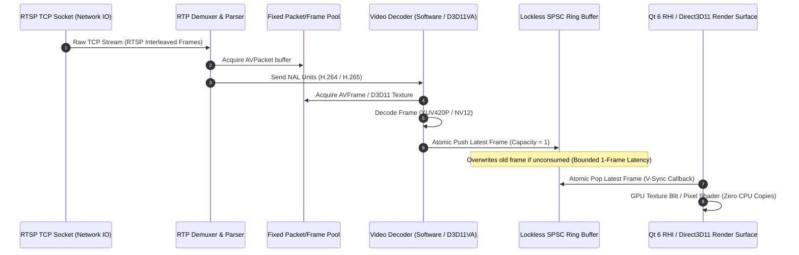

# Production C++20 Media Plane Architecture

## Executive Overview
The Media Plane is the real-time video pipeline responsible for ingesting, demuxing, decoding, and displaying high-throughput video streams across up to 256 channels. The architecture enforces complete physical isolation from the HTTP control plane, bounded memory consumption, and deterministic sub-frame latency.

---

## 1. Media Pipeline Data Flow



---

## 2. Decoder Implementations: Software vs Hardware Acceleration

| Metric / Dimension | Software CPU Baseline (FFmpeg `libavcodec`) | Hardware Acceleration (`D3D11VA` / `DXVA2`) |
| :--- | :--- | :--- |
| **Mandatory Dependency** | **YES (Primary Baseline)** — Guaranteed functional on all Windows PCs. | **NO (Optional Fast Path)** — Selected dynamically when supported GPU detected. |
| **Pixel Format Output** | `AV_PIX_FMT_YUV420P` (Planar YUV) | `AV_PIX_FMT_NV12` / `DXGI_FORMAT_NV12` Direct3D11 Texture |
| **Memory Locality** | System RAM | GPU VRAM |
| **GPU Requirements** | None (Runs on basic Intel Celeron / Core i3/i5/i7/AMD CPUs) | Intel HD Graphics, AMD Radeon, NVIDIA GeForce |
| **CPU Usage (1 Stream)** | ~3–5% (Optimized native C++20 libavcodec with AVX2) | < 1% |
| **CPU Usage (16 Streams)** | ~25–35% (Multithreaded CPU decode pool) | ~4–8% |
| **Display Texture Upload**| `glTexSubImage2D` or Direct3D11 staging buffer upload | Direct GPU shared texture swap / Zero CPU-to-GPU transfer |

---

## 3. Lockless Bounded SPSC Ring Buffer Design

```cpp
#include <atomic>
#include <memory>
#include <span>

namespace optier::vms::media {

template<typename T, size_t Capacity = 2>
class LocklessLatestRingBuffer {
public:
    static_assert(Capacity >= 1, "Capacity must be at least 1");

    LocklessLatestRingBuffer() : write_idx_(0), read_idx_(0), dropped_count_(0) {}

    // Producer Thread (Decoder)
    void push(std::shared_ptr<T> item) noexcept {
        const size_t current_write = write_idx_.load(std::memory_order_relaxed);
        const size_t next_write = (current_write + 1) % Capacity;

        slots_[current_write] = std::move(item);

        if (next_write == read_idx_.load(std::memory_order_acquire)) {
            // Buffer full: advance read pointer to drop oldest frame (Bounded Single-Frame Latency)
            read_idx_.store((next_write + 1) % Capacity, std::memory_order_release);
            dropped_count_.fetch_add(1, std::memory_order_relaxed);
        }

        write_idx_.store(next_write, std::memory_order_release);
    }

    // Consumer Thread (UI Renderer)
    std::shared_ptr<T> getLatest() noexcept {
        const size_t current_read = read_idx_.load(std::memory_order_acquire);
        const size_t current_write = write_idx_.load(std::memory_order_acquire);

        if (current_read == current_write) {
            return nullptr; // Buffer empty
        }

        // Return latest available frame and advance to write index
        const size_t latest_idx = (current_write + Capacity - 1) % Capacity;
        std::shared_ptr<T> frame = slots_[latest_idx];
        read_idx_.store(current_write, std::memory_order_release);
        return frame;
    }

    uint64_t getDroppedCount() const noexcept {
        return dropped_count_.load(std::memory_order_relaxed);
    }

private:
    std::array<std::shared_ptr<T>, Capacity> slots_;
    alignas(64) std::atomic<size_t> write_idx_;
    alignas(64) std::atomic<size_t> read_idx_;
    alignas(64) std::atomic<uint64_t> dropped_count_;
};

} // namespace optier::vms::media
```

---

## 4. Frame Ownership & Zero-Copy Memory Path

1. **RTSP Ingestion**: `libavformat` reads network packets directly into pre-allocated memory pools (`AVBufferRef`).
2. **Decoder Engine**: `libavcodec` decodes NAL units into reusable `AVFrame` buffers managed by a fixed-size `FramePool`.
3. **VMS VideoFrame**: Wraps the `AVFrame` pointer via `std::shared_ptr<VideoFrame>` with a custom deleter that returns the frame to the pool upon destruction.
4. **Ring Buffer**: Holds raw `std::shared_ptr<VideoFrame>` pointers. No array copies occur during enqueue/dequeue.
5. **Renderer (Qt 6 RHI / Direct3D11)**:
   - For Software decoding: Passes planar Y, U, V pointers directly to Direct3D11 dynamic textures; GPU pixel shader performs YUV-to-RGB conversion in hardware.
   - For Hardware decoding: Passes D3D11 texture handle directly to the Qt RHI surface (true zero-copy).
