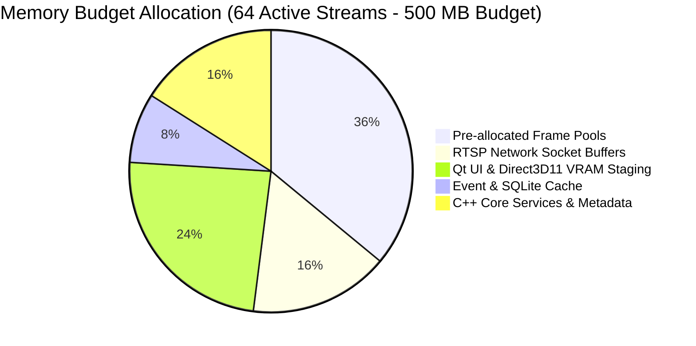

# Production C++20 VMS Performance Model & Benchmark Metrics

## Executive Overview
This document establishes measurable performance targets, resource budgets, and automated benchmark criteria for the production C++20 OPTIER VMS.

---

## 1. Measurable Performance Targets

| Performance Dimension | Benchmark Metric | Target (Software CPU Decode) | Target (D3D11VA GPU Decode) | Measurement Protocol |
| :--- | :--- | :---: | :---: | :--- |
| **Stream Startup Latency** | Time from `startStream()` to first decoded frame on screen | `< 250 ms` | `< 150 ms` | High-resolution clock measurement from RTSP `DESCRIBE` to first `on_frame` invocation. |
| **Stream Reconnect Latency**| Time to recover from sudden network socket drop | `< 1,200 ms` | `< 800 ms` | Automated TCP RST injection test measuring recovery time. |
| **Live Frame Latency** | Network arrival to display buffer blit | `< 45 ms` (1.5 frames) | `< 20 ms` (1 frame) | Timestamp delta from RTP packet presentation timestamp (PTS) to render. |
| **Frame Drop Tolerance** | UI / Decoder drop rate under full rated load | `0.00%` (Zero Drops) | `0.00%` (Zero Drops) | Counted over 10-minute continuous streaming session. |
| **PTZ Control Response** | Time from UI button click to device motion start | `< 60 ms` | `< 60 ms` | Round-trip HTTP request timer for `POST /API/PreviewChannel/PTZ/Control`. |
| **Forensic Search Latency** | Query 100k face / 200k plate records on NVR | `< 350 ms` | `< 350 ms` | End-to-end timer for `POST /API/AI/SnapedObjects/SearchPlate`. |
| **Timeline Scrub Latency** | Playback seek to new second mark | `< 300 ms` | `< 200 ms` | Timestamp seek on `POST /API/PreviewChannel/PlaybackRtspUrl/Get`. |

---

## 2. Resource Utilization Budgets

| Scale Tier | Maximum Allowed CPU Usage (Intel Core i7-12700 / AMD Ryzen 7) | Maximum Allowed Process Working Set RAM | Maximum Network Ingest Bandwidth |
| :---: | :---: | :---: | :---: |
| **1 Stream (1080p Main)** | `< 5.0%` | `< 60 MB` | ~4.0 Mbps |
| **4 Streams (720p Sub)** | `< 12.0%` | `< 85 MB` | ~6.0 Mbps |
| **16 Streams (360p Sub)** | `< 25.0%` | `< 140 MB` | ~8.0 Mbps |
| **36 Streams (360p Sub)** | `< 45.0%` | `< 220 MB` | ~14.0 Mbps |
| **64 Streams (360p Sub)** | `< 65.0%` | `< 350 MB` | ~22.0 Mbps |

---

## 3. Automated Benchmark Harness Plan

1. **`BenchRtspDemuxer`**: Measures raw throughput (packets/sec) and CPU overhead of the RTP parser without decoding.
2. **`BenchDecoderSoftware`**: Tests pure `libavcodec` software decoding across H.264 Baseline/Main/High and H.265 HEVC profiles.
3. **`BenchRingBufferSPSC`**: Stress tests the lockless ring buffer across 100 million push/pop iterations measuring nanosecond contention.
4. **`BenchMultiDeviceSim`**: Simulates 16 physical NVRs with 256 logical channels responding to simultaneous heartbeat, telemetry, and alarm queries.
