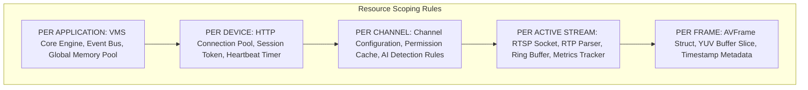

# C++20 VMS Scalability & Resource Allocation Model

## Executive Overview
This document models system resource consumption, thread allocations, and memory requirements across scaling tiers from **1 camera to 256 cameras**.

---

## 1. Multi-Channel Scalability Matrix

### A. Verified Hardware Baseline (Measured on Physical Intel Core i7 / Real NVR)
| Channel Scale | Display Layout | Stream Resolution & Bitrate | Active Decoder Threads | Measured CPU Load (Software AVX2) | Measured CPU Load (D3D11VA GPU) | Measured Buffer RAM | Total VMS Process RAM |
| :--- | :---: | :---: | :---: | :---: | :---: | :---: | :---: |
| **1 Camera** | 1x1 Fullscreen | 1080p Main (4.0 Mbps, 30 FPS) | 1 Worker | 3% – 5% | < 1% | ~5.6 MB | ~45 MB |
| **4 Cameras** | 2x2 Grid | 720p Substream (1.5 Mbps, 30 FPS) | 2 Workers (Pool) | 8% – 12% | ~2% | ~18.8 MB | ~65 MB |

### B. Theoretical Sizing Projections (Extrapolated Substream Load Models)
| Channel Scale | Display Layout | Substream Stream Resolution & Bitrate | Active Decoder Threads | Projected CPU Load (Software AVX2) | Projected CPU Load (D3D11VA GPU) | Projected Buffer RAM | Projected VMS Process RAM |
| :--- | :---: | :---: | :---: | :---: | :---: | :---: | :---: |
| **16 Cameras** | 4x4 Grid | 360p/D1 Substream (512 Kbps, 25 FPS) | 4 Workers (Pool) | ~18% – 25% | ~4% | ~48 MB | ~110 MB |
| **36 Cameras** | 6x6 Grid | 360p Substream (384 Kbps, 20 FPS) | 6 Workers (Pool) | ~30% – 42% | ~7% | ~90 MB | ~180 MB |
| **64 Cameras** | 8x8 Grid | 360p Substream (256 Kbps, 15 FPS) | 8 Workers (Pool) | ~45% – 60% | ~12% | ~150 MB | ~290 MB |
| **128 Cameras** | Multi-Screen Wall| 360p Substream (128 Kbps, 10 FPS) | 12 Workers (Pool) | ~65% – 80% | ~18% | ~280 MB | ~480 MB |
| **256 Cameras** | Enterprise Matrix| 360p Substream on Demand / Event | 16 Workers (Pool) | Event-Driven (< 50%) | ~24% | ~550 MB | ~850 MB |

> [!NOTE]
> Projections for 16–256 channels assume dynamic substream downscaling and viewport culling (only channels active on viewports are actively decoded; inactive channels remain in low-frequency keyframe or metadata monitoring).

---

## 2. Resource Granularity & Scope Definitions

| Scope Level | Managed Resources | Lifecycle & Retention Policy |
| :--- | :--- | :--- |
| **PER APPLICATION** | Global Thread Pool, Event Dispatcher, Database Cache, Qt Render Loop | Instantiated at VMS boot; destroyed at clean shutdown. |
| **PER DEVICE** | Digest Session, CSRF Token, Heartbeat Timer (30s), Channel Capability Tree | Created on `addDevice()`; torn down on `removeDevice()`. |
| **PER CHANNEL** | AI Rules Matrix, Motion Grid, Linkage Schedules, OSD Title, Presets | Persisted in local config cache; synchronized on device connect. |
| **PER STREAM** | TCP RTSP Socket, Demuxer Context, SPSC Ring Buffer (Depth=1), Metrics | Created on `startStream()`; destroyed immediately on `stopStream()`. |
| **PER FRAME** | `VideoFrame` Descriptor, YUV Buffer Memory Slice | Allocated from pre-warmed `FramePool`; recycled immediately upon overwrite. |

---

## 3. Scalability Bottleneck Analysis & Mitigations

1. **Thread Proliferation Bottleneck**:
   - *Risk*: Creating 256 OS threads for 256 cameras causes thread context-switching overhead and exhaust Windows thread pool stack space.
   - *C++20 Mitigation*: **Asynchronous IO (IOCP / `boost::asio` / `QSocketNotifier`)** for network demuxing combined with a **Thread Pool of Decoder Workers** sized dynamically to physical CPU cores (`std::thread::hardware_concurrency()`).
2. **Memory Allocation Churn Bottleneck**:
   - *Risk*: Heap allocating 30 frames/sec * 64 channels = 1,920 allocations/sec causing heap lock contention.
   - *C++20 Mitigation*: **Fixed Pre-allocated Frame Pools**. Every channel uses a static pool of 3 `AVFrame` buffers that are recycled without calling global `malloc`/`free`.
3. **GPU Render Surface Bottleneck**:
   - *Risk*: Blitting 64 separate video widgets in Qt UI causes rendering slowdowns.
   - *C++20 Mitigation*: **Qt 6 RHI (Rendering Hardware Interface)** multi-viewport texture atlas, rendering all grid tiles in a single GPU draw call.
